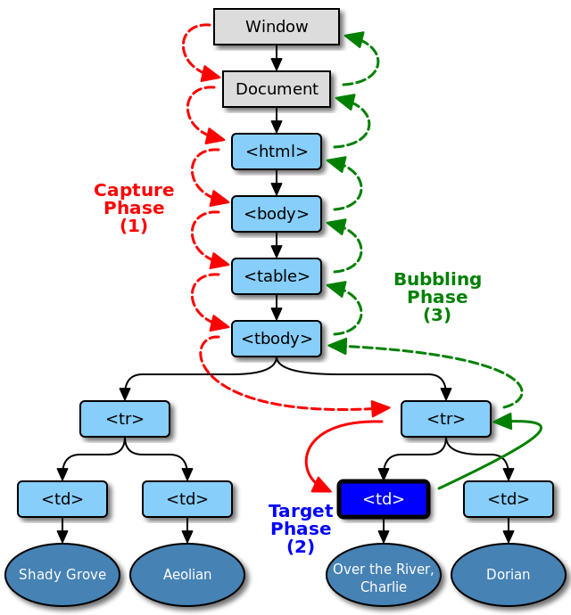

# Event delegation



* **EventTarget.addEventListener\(type, listener\[, useCapture\]\)**
  * Регистрирует обработчик события, вызванного на `EventTarget`. `EventTarget` должен быть либо существующим элементом в документе, либо  `Document`, либо `Window`, либо любым другим объектом, который поддерживает события \(такой, как `XMLHttpRequest`\).
* **EventTarget.dispatchEvent\(event\)**
  * Отправляет событие в общую систему событий. Это событие подчиняется тем же правилам поведения "Захвата" и "Всплывания" как и непосредственно инициированные события.
* **Event.preventDefault\(\)**
  * Отменяет событие, если оно отменяемое, без остановки дальнейшего распространения этого события.
* **Event.stopPropagation\(\)**
  * Прекращает дальнейшую передачу текущего события.
* **Event.stopImmediatePropagation\(\)**
  * Останавливает цепочку вызова событий для последующих слушателей DOM элемента.



{% embed url="http://stepansuvorov.com/blog/2013/05/%D0%BE%D1%82%D0%BB%D0%B8%D1%87%D0%B8%D0%B5-preventdefault-stoppropagation-%D0%B8-stopimmediatepropagation/" %}

