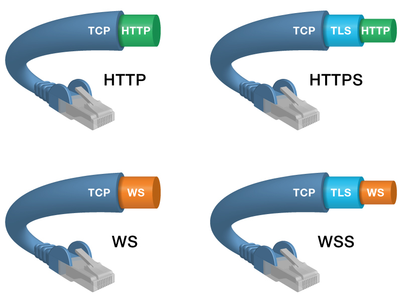

# WebSocket

Протокол WebSocket (стандарт RFC 6455) предназначен для решения любых задач и снятия ограничений обмена данными между браузером и сервером. Он позволяет пересылать любые данные, на любой домен, безопасно и почти без лишнего сетевого трафика.





### Рукопожатие между клиентом и сервером.&#x20;

Когда создаётся объект WebSocket, между клиентом и сервером выполняется рукопожатие, формирующее соединение WebSocket.
&#x20;IE10 начинает процесс рукопожатия с посылки HTTP-запроса на сервер:

Пьеса по распределению ролей при запросе соединения - что происходит в заголовке http запроса.

**Клиент -** заголовок со стороны клиента.

Процесс соединения начинается со стандартного запроса HTTP GET, что позволяет запросу проходить через сетевые экраны, прокси и другие промежуточные пункты.&#x20;

```
GET /echo HTTP/1.1
Host: example.microsoft.com
```

HTTP-заголовок Upgrade является запросом к серверу на переключение протокола уровня приложения с HTTP на WebSocket.

```
Upgrade: websocket
Connection: Upgrade
```

Сервер трансформирует значение заголовка Sec-WebSocket-Key при ответе, чтобы продемонстрировать, что он понимает протокол WebSocket:

```
Sec-WebSocket-Key: dGhlIHNhbXBsZSBub25jZQ==
```

Заголовок Origin формируется IE10, чтобы позволить серверу применить политику безопасности, основанную на источнике.

```
Origin: http://microsoft.com
```

Заголовок Sec-WebSocket-Version идентифицирует запрашиваемую версию протокола.

```
Sec-WebSocket-Version: 13
```

**Сервер**

Если сервер принимает запрос на обновление протокола уровня приложения, он возвращает ответ HTTP 101 Switching Protocols:

```
HTTP/1.1 101 Switching Protocols
Upgrade: websocket
Connection: Upgrade
```

Для демонстрации того, что он действительно понимает протокол WebSocket, сервер выполняет стандартизованное преобразование значения заголовка Sec-WebSocket-Key из клиентского запроса, и возвращает результат в заголовке Sec-WebSocket-Accept:

```
Sec-WebSocket-Accept: s3pPLMBiTxaQ9kYGzzhZRbK+xOo=
```

**Снова Клиент**

&#x9;IE10 затем соотносит значение Sec-WebSocket-Key со значением Sec-WebSocket-Accept, чтобы гарантировать, что сервер действительно является сервером WebSocket, а не чем-то иным. Клиентское рукопожатие формирует соединение HTTP поверх TCP между IE10 и сервером.&#x20;

**Теперь Сервер**

&#x9;После того, как сервер возвращает ответ 101, протокол уровня приложения переключается с HTTP на WebSockets, который использует ранее установленное соединение TCP.

### Атрибут WebSocket.readyState

* CONNECTING - WebSocket только создан
* OPEN - соединение установлено успешно
* CLOSING
* CLOSED - соединение не удалось установить

### Шаблон создание соединения  WebSocket:

1\) **создание WebSocket**:

```
var socket = new WebSocket("ws://адрес сервера"); // или wss://адрес сервера
```

2\) **Отсылка сообщения**. WebSocket позволяет пересылать любые запросы: бинарные, текстовые, файловые структуры.

```
function sendTextMessage() {
		// проверка на установку соединения 
  		if (socket.readyState !== WebSocket.OPEN) {
    		return;
  		}
  	var e = document.getElementById("textmessage");
  	socket.send(e.value);
  	// пересылаем строку
  	socket.send(form.elements[0].file);
  	// или пересылаем файл
}
```

3\) **Подписки на события**. Вместо Promise технология использует создание подписок на все, что происходит:

3.1 Подписка на события установки соединения. Чтобы получать уведомления о том, что соединение было создано, приложение должно подписаться на события open.

```
socket.onopen = function (openEvent) {
	  	document.getElementById("serverStatus").innerHTML = 'Web Socket State::' + 'OPEN';
};
```

3.2 Подписка на прием сообщения:

```
socket.onmessage = function (messageEvent) {
	document.getElementById("textresponse").value = messageEvent.data;
}
```

3.3 Подписка на событие закрытия соединения.

```
socket.onclose = function (closeEvent) {
    document.getElementById("serverStatus").innerHTML = 'Web Socket State::' + 'CLOSED';
};
```

3.4 Подписка на ошибку:

```
socket.onerror = function(error) {
	alert("Ошибка " + error.message);
};
```

4\) **Закрытие соединения**. Подобно приветственному рукопожатию, есть также и прощальное рукопожатие. Любая из сторон (приложение или сервер) может инициировать этот процесс. Специальный тип фрейма (закрывающий фрейм) посылается другой стороне. Закрывающий фрейм может содержать опциональный код статуса и причину закрытия. Протокол определяет несколько соответствующих значений для кода статуса. Отправитель закрывающего фрейма обязан более не посылать никаких данных после закрывающего фрейма. Когда другая сторона получает закрывающий фрейм, она отвечает своим собственным закрывающим фреймом. Она может оправить предварительно несколько сообщений до закрывающего фрейма.

```
socket.close(1000, "normal close");
```

где есть два параметра:

* код статуса из списка определённых в протоколе (должен быть равен 1000 или другому числу из таблицы определения)
* описание

