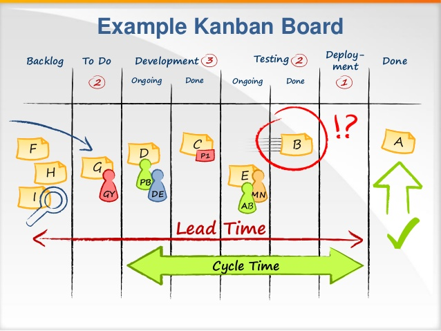
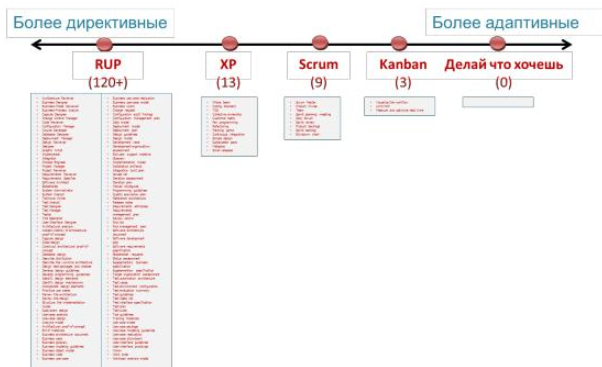

# Software Development Methodology

* Водопадная \(каскадная, последовательная\) модель
* Итерационная модель
* Спиральная модель

## Waterfall

Проект реализуется пошагово в соответствии с заранее определенной последовательностью действий. Переход от одной фазы к другой происходит только после полного и успешного завершения предыдущей. Последовательность фаз разработки:

1. Анализ требований
2. Проектирование
3. Разработка
4. Тестирование и отладка
5. Инсталляция
6. Поддержка

**Недостатки**: 

* Если на одном из ранних этапов будет допущена ошибка, вероятнее всего, обнаружить ее удастся только на этапе разработки или тестирования

**Преимущества**:

* Полная и согласованная документация на каждом этапе
* Легко определить сроки и затраты на проект

Рекомендуется применять данную модель только в том случае, если все требования, предъявляемые к конечному продукту точно установлены с самого начала работы и не изменяются во время разработки.

## Agile

Это семейство «гибких» подходов к разработке программного обеспечения. Большинство гибких методологий нацелены на минимизацию рисков путём сведения разработки к серии коротких циклов, называемых итерациями, которые обычно длятся две-три недели. Каждая итерация сама по себе выглядит как программный проект в миниатюре и включает все задачи, необходимые для выдачи мини-прироста по функциональности: планирование, анализ требований, проектирование, программирование, тестирование и документирование. Хотя отдельная итерация, как правило, недостаточна для выпуска новой версии продукта, подразумевается, что гибкий программный проект готов к выпуску в конце каждой итерации. По окончании каждой итерации команда выполняет переоценку приоритетов разработки.

**Недостатки**:

1.  Гибкий подход к управлению требованиями не подразумевает далеко идущих планов , а подразумевает возможность заказчика вдруг и неожиданно в конце каждой итерации выставлять новые требования, часто противоречащие архитектуре уже созданного и поставляемого продукта.
2. Мотивирует разработчиков решать все поступившие задачи простейшим и быстрейшим возможным способом, при этом зачастую не обращая внимания на правильность кода. Это приводит к снижению качества продукта и накоплению дефектов.

### Scrum

Scrum — это «подход структуры». Над каждым проектом работает универсальная команда специалистов, к которой присоединяется еще два человека: **владелец продукта** и **scrum-мастер**. Первый соединяет команду с заказчиком и следит за развитием проекта; это не формальный руководитель команды, а скорее куратор. Второй помогает первому организовать бизнес-процесс: проводит общие собрания, решает бытовые проблемы, мотивирует команду и следит за соблюдением scrum-подхода.

Scrum-подход делит рабочий процесс на равные спринты — обычно это периоды от недели до месяца, в зависимости от проекта и команды. Перед спринтом формулируются задачи на данный спринт, в конце — обсуждаются результаты, а команда начинает новый спринт. Спринты очень удобно сравнивать между собой, что позволяет управлять эффективностью работы.  

 В конце спринта происходит демо \(demo, демонстрация\) с показом того, что удалось создать в течение спринта, спринт-ревью \(sprint review, обзор спринта\) с пересмотром продакт-беклога и разговорами о том, ЧТО мы делаем, а также ретроспектива \(retro\) — что мы делали не самым лучшим образом весь спринт и хотим улучшить далее — о том, КАК мы это делаем.

#### _Принципы управления проектами по_  Scrum _:_

1. Разбейте всю команду проекта на небольшие, кросс-функциональные, самоорганизующиеся команды
2. Разбейте все работы по проекту на небольшие, конкретные задачи. Расставьте приоритеты и связи между задачами
3. Разбейте время проекта на короткие, одинаковые по продолжительности итерации \(обычно 1-4 недели\) с четкими результатами по истечении каждой
4. На встрече с заказчиками проекта скорректируйте план работ и приоритеты
5. Оптимизируйте процесс, проводя ретроспективу после каждой итерации. 

    Главный показатель эффективности в scrum — это среднее время прохождения задачи по доске. Задача прошла быстро — команда работала продуктивно и слаженно. Задача затянулась — надо думать, на каком этапе и почему возникли задержки и чью работу надо оптимизировать.

### Kanban

Kanban — это «подход баланса». Его задача — сбалансировать разных специалистов внутри команды и избежать ситуации, когда дизайнеры работают сутками, а разработчики жалуются на отсутствие новых задач.

Вся команда едина — в kanban нет ролей владельца продукта и scrum-мастера. Бизнес-процесс делится не на универсальные спринты, а на стадии выполнения конкретных задач: «Планируется», «Разрабатывается», «Тестируется», «Завершено» и др.

#### _Принципы управления проектами по_  Kanban:

1. Визуализация линии времени с размещенными на ней работами
2. Ограничение количества работ, которые могут выполняться одновременно \(Work in Progress\)
3. Измерение времени на выполнение одной задачи

### XP

**Экстремальное программирование** \(англ. Extreme Programming, XP\) — один из гибких методологий разработки программного обеспечения. Эта методология включает в себя большую часть Scrum + кучу весьма конкретных инженерных практик.

* _Разработка через тестирование \(Test-driven development\):_ - юнит-тестирование модулей - функциональное \(тестирование взаимодействия модулей\) В соответствии с этим подходом сначала пишется тест, затем реализуется логика, необходимая для того, чтобы тест прошёл.
* _Парное программирование:_ Один из них работает непосредственно с текстом программы, другой просматривает его работу и следит за общей картиной происходящего.
* _Непрерывная интеграция \(Continuous integration\):_ Интеграция кода всей системы выполняется несколько раз в день, после того, как разработчики убедились в том, что все тесты модулей корректно срабатывают.
* _Рефакторинг \(Design improvement, Refactoring\):_ Это методика улучшения кода без изменения его функциональности.

### Lean

**Бережливая разработка программного обеспечения** — методология разработки программного обеспечения, использующая методы концепции бережливого производства.

Принципы:

* _**Исключение потерь**._ Потерями считается всё, что не добавляет ценности для потребителя. В частности: излишняя функциональность; ожидание \(паузы\) в процессе разработки; нечёткие требования; бюрократизация; медленное внутреннее сообщение.
* _**Акцент на обучении.**_ Короткие циклы разработки, раннее тестирование, частая обратная связь с заказчиком.
* _**Предельно отсроченное принятие решений.**_ Решение следует принимать не на основе предположений и прогнозов, а после открытия существенных фактов.
* _**Предельно быстрая доставка заказчику.**_ Короткие итерации.
* _**Мотивация команды.**_ Нельзя рассматривать людей исключительно как ресурс. Людям нужно нечто большее, чем просто список заданий.
* _**Интегрирование**_**.** Передать целостную информацию заказчику. Стремиться к целостной архитектуре. Рефакторинг.
* _**Целостное видение.**_ Стандартизация, установление отношений между разработчиками. Разделение разработчиками принципов бережливости. «Мыслить широко, делать мало, ошибаться быстро; учиться стремительно».

### FDD

**Feature driven development** \(**FDD**, разработка, управляемая функциональностью\) — итеративная методология разработки программного обеспечения, одна из гибких методологий разработки \(agile\). FDD представляет собой попытку объединить наиболее признанные в индустрии разработки программного обеспечения методики, принимающие за основу важную для заказчика функциональность \(свойства\) разрабатываемого программного обеспечения. Основной целью данной методологии является разработка реального, работающего программного обеспечения систематически, в поставленные сроки.  
FDD включает в себя пять базовых видов деятельности:

1. разработка общей модели;
2. составление списка необходимых функций системы;
3. планирование работы над каждой функцией;
4. проектирование функции;
5. реализация функции.

Первые два процесса относятся к началу проекта. Последние три осуществляются для каждой функции. Разработчики в FDD делятся на «хозяев классов» и «главных программистов». Главные программисты привлекают хозяев задействованных классов к работе над очередным свойством. Работа над проектом предполагает частые сборки и делится на итерации, каждая из которых предполагает реализацию определенного набора функций.

### DDD

**Предметно-ориентированное проектирование** \(реже проблемно-ориентированное, англ. Domain-driven design, DDD\) — это набор принципов и схем, направленных на создание оптимальных систем объектов. Сводится к созданию программных абстракций, которые называются моделями предметных областей. В эти модели входит бизнес-логика, устанавливающая связь между реальными условиями области применения продукта и кодом.

Предметно-ориентированное проектирование не является какой-либо конкретной технологией или методологией. DDD — это набор правил, которые позволяют принимать правильные проектные решения. Данный подход позволяет значительно ускорить процесс проектирования программного обеспечения в незнакомой предметной области.

Подход DDD особо полезен в ситуациях, когда разработчик не является специалистом в области разрабатываемого продукта. К примеру: программист не может знать все области, в которых требуется создать ПО, но с помощью правильного представления структуры, посредством проблемно-ориентированного подхода, может без труда спроектировать приложение, основываясь на ключевых моментах и знаниях рабочей области.

Концепция  
Схема архитектуры приложения представляет собой описание одной или нескольких моделей предметной области и их взаимосвязей между собой.

* Ограниченные связи -   используется для уменьшения различных связей между моделями, что исключает сложность и запутанность [кода](https://ru.wikipedia.org/wiki/%D0%9F%D1%80%D0%BE%D0%B3%D1%80%D0%B0%D0%BC%D0%BC%D0%BD%D1%8B%D0%B9_%D0%BA%D0%BE%D0%B4).
* Целостность - необходимость объединение кусков кода от различных разработчиков и проверка работоспособности посредством [тестирования](https://ru.wikipedia.org/wiki/%D0%A2%D0%B5%D1%81%D1%82%D0%B8%D1%80%D0%BE%D0%B2%D0%B0%D0%BD%D0%B8%D0%B5_%D0%BF%D1%80%D0%BE%D0%B3%D1%80%D0%B0%D0%BC%D0%BC%D0%BD%D0%BE%D0%B3%D0%BE_%D0%BE%D0%B1%D0%B5%D1%81%D0%BF%D0%B5%D1%87%D0%B5%D0%BD%D0%B8%D1%8F) для избежания потери целостности.
* Взаимосвязь - установка взаимосвязей между моделями для упрощения процесса общей сборки конечного продукта.

## Waterfall vs Scrum vs Kanban

* Подход к ограничению количества выполняемых задач - **Kanban** для каждого этапа разработки еще на стадии проектирования выбирается максимальное число задач, которые могут выполняться одновременно. -  **Scrum**, не ограничивает вас количеством задач, которые могут выполняться на определенном этапе. Можно говорить только об определенном количестве задач, запланированном для спринта в целом.
* Различные подходы к организации Scrum и Kanban досок -  В  **Scrum** каждая итерация называется **спринтом**. На основе бэклога продукта в начале каждого спринта создается **бэклог спринта** — список задач, которые необходимо реализовать за время работы над текущим спринтом.  Владелец продукта может наблюдать за бэклогом спринта, но вмешиваться в очередность задач, из которого он состоит, нельзя. Можно вносить изменения только в бэклог продукта, но они вступят в силу только после начала очередного спринта. Результатом работы над каждым спринтом является готовый продукт. После ретроспективы и демонстрации его функциональности владелец проекта принимает решение о том, стоит выпускать продукт или нет. Эти решающие стадии каждого спринта обычно не входят в бэклог и никак не отображаются на доске. -  В  **Kanban** доской дело обстоит несколько иначе. Srum доска очищается от карточек по завершении каждого стрима. На Kanban доске отображается весь процесс разработки целиком, а не только задачи одной команды, запланированные на одну итерацию. Таким образом, Kanban доска остается неизменной. Также стоит отметить, что на Kanban доске обычно отображаются финальные фазы разработки, например, установка готового продукта.

{% embed data="{\"url\":\"https://youtu.be/nIVtnVINPkE\",\"type\":\"video\",\"title\":\"Проясняем, что такое Scrum и  Kanban путем их сравнения\",\"description\":\"https://crisp.se/\\nПо книге Генриха Книберга.\",\"icon\":{\"type\":\"icon\",\"url\":\"https://www.youtube.com/yts/img/favicon\_144-vfliLAfaB.png\",\"width\":144,\"height\":144,\"aspectRatio\":1},\"thumbnail\":{\"type\":\"thumbnail\",\"url\":\"https://i.ytimg.com/vi/nIVtnVINPkE/maxresdefault.jpg\",\"width\":1280,\"height\":720,\"aspectRatio\":0.5625},\"embed\":{\"type\":\"player\",\"url\":\"https://www.youtube.com/embed/nIVtnVINPkE?rel=0&showinfo=0\",\"html\":\"
<iframe src=\\\"https://www.youtube.com/embed/nIVtnVINPkE?rel=0&amp;showinfo=0\\\" style=\\\"border: 0; top: 0; left: 0; width: 100%; height: 100%; position: absolute;\\\" allowfullscreen scrolling=\\\"no\\\"></iframe>
\",\"aspectRatio\":1.7778},\"caption\":\"Сравнение SCRUM и KANBAN\"}" %}

