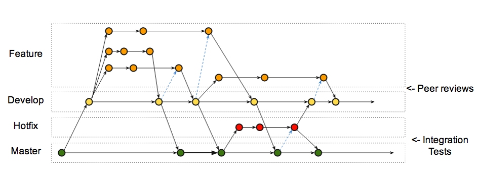

# Version Control System

**Система контроля версий** \(Version Control System, VCS или Revision Control System\) — программное обеспечение для облегчения работы с изменяющейся информацией. Система контроля версиями позволяет хранить несколько версий одного и того же документа, при необходимости возвращаться к более ранним версиям, определять, кто и когда сделал то или иное изменение, и многое другое.

## GIT



**Git** — распределённая система управления версиями. Проект был создан Линусом Торвальдсом для управления разработкой ядра Linux, первая версия выпущена 7 апреля 2005 года. На сегодняшний день его поддерживает Джунио Хамано.

[Как работает Git](https://habr.com/post/313890/)  
[https://git-scm.com/doc](https://git-scm.com/doc)  
[https://education.github.com/git-cheat-sheet-education.pdf](https://education.github.com/git-cheat-sheet-education.pdf)  
[https://services.github.com/on-demand/downloads/github-git-cheat-sheet.pdf](https://services.github.com/on-demand/downloads/github-git-cheat-sheet.pdf)

### Branching & **GitFlow**

**GitFlow** is a branching model for Git, created by Vincent Driessen. It has attracted a lot of attention because it is very well suited to collaboration and scaling the development team [https://datasift.github.io/gitflow/IntroducingGitFlow.html](https://datasift.github.io/gitflow/IntroducingGitFlow.html)

### **“git reset”**

Команда `reset` в заранее определенном порядке перезаписывает три дерева Git, останавливаясь тогда, когда вы ей скажете

### **“git merge” vs “git rebase”**.

В Git'е есть два способа включить изменения из одной ветки в другую: merge \(слияние\) и rebase \(перемещение\). Наиболее простое решение для объединения веток – это команда **merge**:

`$ git merge С3`

Эта команда выполняет трёхходовое слияние между двумя последними снимками состояний из веток \(C3 и C4\) и последним общим предком этих двух веток \(C2\), создавая новый снимок состояния \(и коммит\). Таким образом сохраняются две независимые ветки изменений. Финальное состояние С5 будет иметь двух предков – С3 и С4.

Однако, есть и другой путь: Вы можете взять изменения, представленные в C3, и применить их после C4. В Git'е это называется перемещение \(rebasing\). При помощи команды **rebase** вы можете взять все изменения, которые попали в коммиты на одной из веток, и повторить их на другой.

`$ git checkout experiment`

`$ git rebase master`

Перемещение работает следующим образом: находится общий предок для двух веток \(на которой вы находитесь сейчас и на которую вы выполняете перемещение\); для каждого из коммитов в текущей ветке берётся его дельта и сохраняется во временный файл; текущая ветка устанавливается на тот же коммит, что и ветка, на которую выполняется перемещение; и, наконец, одно за другим применяются все изменения. Таким образом изменения вносятся не на этапе предка С2, а цепочка идет по пути: С2 – С4 – С3’.

Команду **rebase** рекомендуется применять в частных репозиториях для предотвращения безграничного ветвления и упорядочивания порядка коммитов. Команду **merge** лучше применять для внесения изменений в публичные репозитории, когда коммиты от разных авторов имеют разных предков, сохраняют свою история изменений с самого общего начала и паралельно вливаются друг в друга.

### "git cherry-pick"

## CVS

**CVS** \(Concurrent Versions System, «Система одновременных версий»\) — программный продукт, относящийся к разряду систем управления версиями. Хранит историю изменений определённого набора файлов, как правило, исходного кода программного обеспечения, и облегчает совместную работу группы людей над одним проектом.

**Преимущества:**

* Испытанная временем технология, которая удерживается на рынке десятки лет.

**Недостатки:**

* Переименование или перемещение файлов не отражается в истории
* Риски безопасности, связанные с символическими ссылками на файлы
* Нет поддержки атомарных операций, что может привести к повреждению кода
* Операции с ветками программного кода дорогостоящие, так как эта система контроля не предназначена для долгосрочных проектов с ветками кода

## SVN 

Subversion \(также известная как «SVN»\) — свободная централизованная система управления версиями, официально выпущенная в 2004 году компанией CollabNet. С 2010 года Subversion является одним из проектов Apache Software Foundation и официально называется Apache Subversion \(зарегистрированный товарный знак​\).

[**SVN**](http://subversion.apache.org/) создавалась как альтернатива CVS с целью исправить недостатки CVS и в то же время обеспечить высокую совместимость с ней.

**Преимущества:** 

* Система на основе CVS
* Допускает атомарные операции
* Операции с ветвлением кода менее затратны
* Широкий выбор плагинов IDE
* Не использует пиринговую модель

**Недостатки:**

* Сохраняются ошибки, связанные с переименованием файлов/директорий
* Неудовлетворительный набор команд для работы с репозиторием
* Сравнительно небольшая скорость

  
В SVN мы, как правило, работали с одной веткой trunk \(в git ветка, с которой мы работаем по умолчанию, называется master\). Эта же ветка заливалась на продакшн. Главное неудобство здесь — то, что если мы производим какие-то изменения, или разрабатываем новый функционал, мы вынуждены либо сидеть и не коммитить до тех пор, пока задача не будет доделана до конца, либо \(если нам нужна помощь коллеги\), закоммитить недоделанный функционал, как есть, сделав таким образом trunk непригодным к заливке на продакшн.

## Mercurial 

**Mercurial** \(с англ. — «ртутный, подвижный»\), он же **Hg** \(от обозначения химического элемента ртути\) — кроссплатформенная распределённая система управления версиями, разработанная для эффективной работы с очень большими репозиториями кода.

Mercurial появился в результате того же конфликта, что привёл к созданию Git. Автором новой системы стал Мэт Мэкол \(Matt Mackall\).  

