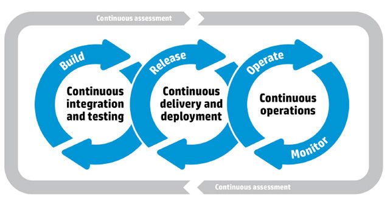

# Continuous Integration & Continuous Delivery & Deployment

[Какая разница между Continuous Delivery, Continuous Deployment и Continuous Integration](http://qaat.ru/kakaya-raznica-mezhdu-continuous-delivery-continuous-deployment-i-continuous-integration/)

**Continuous Delivery** \(непрерывная доставка\) — это серия практик, направленных на то, чтобы обновления программного обеспечения происходили практически постоянно. Обеспечивает постоянный выпуск обновлений пользователям.

**Continuous Deployment** \(непрерывное развёртывание\) отвечает за то, чтобы весь новый функционал после тестирования сразу же попал в основную программу без ручного вмешательства инженеров DevOps.

**Continuous Integration** \(непрерывная интеграция\) – поиск и устранение потенциальных проблем как можно быстрее, улучшение качества ПО и сокращение время для выпуска обновлений.

## TFS

You can integrate TFS with all kinds of tooling but if you want to use all TFS offers you, you can use the following:

* A Build Definition for your project that uses one of your build servers. This Build Definition can be configured to run as a CI build and store the build output on the TFS server. This output can then be downloaded as a zip file through the web portal.
* For deployment, [Microsoft Release Management](http://www.visualstudio.com/en-us/explore/release-management-vs.aspx) is the recommended tooling. RM can be tied to your build \(using a special Release Management template that stores the build output in a shared folder on your server\).

Combining CI builds with Release Management gives you a nice solution for continuous deployment through all kinds of environments

Another option is by using [Lab Management.](http://www.visualstudio.com/en-us/explore/lab-management-vs.aspx) This is well suited for deploying and managing test environments, both physical and virtual.

When it comes to best practices for TFS I would love to point you to all the [guidance we created as ALM Rangers.](http://aka.ms/vsarsolutions) Here you will find guidance on installing, configuring and running TFS in all kinds of scenarios including Build servers and DevOps automatic deployment scenarios.

## TeamCity vs Jenkins

Both **Jenkins** and **TeamCity** are continuous integration tools that serve many of the same purposes. Jenkins is an open source tool, while TeamCity is a proprietary offering from JetBrains. Jenkins is older than TeamCity, so it has a larger community and wider use in general; it appears in far more stacks than its competitor. TeamCity is considered by users to be easier to configure and more straightforward to use, while Jenkins is appreciated for its rich set of plugins and integrations.

## Build modes

| **Debug mode** | **Release mode** |
| :--- | :--- |
| should be bundled | should be unbudled |
| for debug purposes, cannot be minified | will be minified and will remove all debug statements |
| it's not necessary to change the version number | bump up the versin number |

## SonarQube 

Платформа с открытым исходным кодом для непрерывного анализа \([англ.](https://ru.wikipedia.org/wiki/%D0%90%D0%BD%D0%B3%D0%BB%D0%B8%D0%B9%D1%81%D0%BA%D0%B8%D0%B9_%D1%8F%D0%B7%D1%8B%D0%BA) continuous inspection\) и измерения качества кода.

 SonarQube измеряет качество программного кода в соответствии с семью показателями \(и соответствующими [метриками](https://ru.wikipedia.org/wiki/%D0%9C%D0%B5%D1%82%D1%80%D0%B8%D0%BA%D0%B0_%D0%BF%D1%80%D0%BE%D0%B3%D1%80%D0%B0%D0%BC%D0%BC%D0%BD%D0%BE%D0%B3%D0%BE_%D0%BE%D0%B1%D0%B5%D1%81%D0%BF%D0%B5%D1%87%D0%B5%D0%BD%D0%B8%D1%8F)\) [качества программного обеспечения](https://ru.wikipedia.org/wiki/%D0%9A%D0%B0%D1%87%D0%B5%D1%81%D1%82%D0%B2%D0%BE_%D0%BF%D1%80%D0%BE%D0%B3%D1%80%D0%B0%D0%BC%D0%BC%D0%BD%D0%BE%D0%B3%D0%BE_%D0%BE%D0%B1%D0%B5%D1%81%D0%BF%D0%B5%D1%87%D0%B5%D0%BD%D0%B8%D1%8F), которые разработчики называют [англ.](https://ru.wikipedia.org/wiki/%D0%90%D0%BD%D0%B3%D0%BB%D0%B8%D0%B9%D1%81%D0%BA%D0%B8%D0%B9_%D1%8F%D0%B7%D1%8B%D0%BA) Seven Axes of Quality.

* Потенциальные [ошибки](https://ru.wikipedia.org/wiki/%D0%91%D0%B0%D0%B3)
* [Стиль программирования](https://ru.wikipedia.org/wiki/%D0%A1%D1%82%D0%B8%D0%BB%D1%8C_%D0%BF%D1%80%D0%BE%D0%B3%D1%80%D0%B0%D0%BC%D0%BC%D0%B8%D1%80%D0%BE%D0%B2%D0%B0%D0%BD%D0%B8%D1%8F)
* [Тесты](https://ru.wikipedia.org/wiki/%D0%A2%D0%B5%D1%81%D1%82%D0%B8%D1%80%D0%BE%D0%B2%D0%B0%D0%BD%D0%B8%D0%B5_%D0%BF%D1%80%D0%BE%D0%B3%D1%80%D0%B0%D0%BC%D0%BC%D0%BD%D0%BE%D0%B3%D0%BE_%D0%BE%D0%B1%D0%B5%D1%81%D0%BF%D0%B5%D1%87%D0%B5%D0%BD%D0%B8%D1%8F)
* [Повторения участков кода](https://ru.wikipedia.org/wiki/Don%E2%80%99t_repeat_yourself)
* [Комментарии](https://ru.wikipedia.org/wiki/%D0%9A%D0%BE%D0%BC%D0%BC%D0%B5%D0%BD%D1%82%D0%B0%D1%80%D0%B8%D0%B8_%28%D0%BF%D1%80%D0%BE%D0%B3%D1%80%D0%B0%D0%BC%D0%BC%D0%B8%D1%80%D0%BE%D0%B2%D0%B0%D0%BD%D0%B8%D0%B5%29)
* [Архитектура](https://ru.wikipedia.org/wiki/%D0%90%D1%80%D1%85%D0%B8%D1%82%D0%B5%D0%BA%D1%82%D1%83%D1%80%D0%B0_%D0%BF%D1%80%D0%BE%D0%B3%D1%80%D0%B0%D0%BC%D0%BC%D0%BD%D0%BE%D0%B3%D0%BE_%D0%BE%D0%B1%D0%B5%D1%81%D0%BF%D0%B5%D1%87%D0%B5%D0%BD%D0%B8%D1%8F) и [проектирование](https://ru.wikipedia.org/wiki/%D0%9F%D1%80%D0%BE%D0%B5%D0%BA%D1%82%D0%B8%D1%80%D0%BE%D0%B2%D0%B0%D0%BD%D0%B8%D0%B5_%D0%BF%D1%80%D0%BE%D0%B3%D1%80%D0%B0%D0%BC%D0%BC%D0%BD%D0%BE%D0%B3%D0%BE_%D0%BE%D0%B1%D0%B5%D1%81%D0%BF%D0%B5%D1%87%D0%B5%D0%BD%D0%B8%D1%8F)
* Сложность

## JSLint

**JSLint** — это статический анализатор кода с веб-интерфейсом для программ на языке JavaScript, проверяющий их соответствие стандартам оформления кода, разработанный Дугласом Крокфордом.

## Tests

## **Server build version update**

[https://ru.wikipedia.org/wiki/Нумерация\_версий\_программного\_обеспечения](https://ru.wikipedia.org/wiki/Нумерация_версий_программного_обеспечения)

